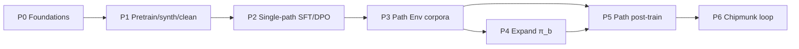

# Plan: Multi-Path Creative Language Model (Brain Spa)

Status: **planning only** — no implementation in this PR.  
Research reference (prior art, why, open questions):
[research-multi-path-creative-decoding.md](research-multi-path-creative-decoding.md).  
**Precise RL / module / repo-manipulation architecture (graphs + losses):**
[plan-path-rl-architecture.md](plan-path-rl-architecture.md).  
Construction catalog (OSS recipes/backends):
[training-methods.md](training-methods.md).

This document is the **Brain Spa build plan**: what we assemble, in which
phase, which OSS pieces we borrow, and **how we warp them** so they serve the
Evidence → Datasets → Tune → Test loop — not a generic LLM lab.

For **exact** MDPs, mermaid graphs, loss sketches, and per-repo “take / change /
wire / don’t” tables, use [plan-path-rl-architecture.md](plan-path-rl-architecture.md).

## Product target (specific to us)

Ship a **local language-model path** that can:

1. Explore **multiple continuations** at the right tokens/chunks (not everywhere).
2. **Select or splice** the best parts into one answer.
3. Learn from **corrected reasoning** (human or agent) and from **2–4 OSS
   teacher traces** sharing the same locked start.
4. Stay inspectable: forks, expands, edits, and scores are artifacts under
   `~/.brain-spa`, never committed weights/dumps.

Snake Policy and Studio stay the policy/tabular references. This plan is the
**language-model** lane in [ml-model-types.md](ml-model-types.md).

## Separation of concerns

| Doc | Job |
|-----|-----|
| **This plan** | Phases, Brain Spa Env overview, borrow→adapt, exit criteria |
| [plan-path-rl-architecture.md](plan-path-rl-architecture.md) | **Precise** modules, MDPs, training graphs, losses, repo warps |
| [research-…](research-multi-path-creative-decoding.md) | Prior art, bets, open questions, architecture rationale |
| [training-methods.md](training-methods.md) + deep dives | Generic OSS methods, backends, cleaning, RL catalog |

Do not mix “what papers did” into phase checklists. Cite research; execute here.

---

## Unified Path Env (one harness family, several modes)

Stop treating Correct-the-reasoning, teacher fanout, token vines, expand
control, and multi-agent judge as separate products. They are **modes of one
Path Env** that always shares:

- a **prefix / locked start** `S`
- zero or more **continuations**
- a **scorer** (same module in Test and Tune — RLVR rule)
- JSONL artifacts with a common schema

```text
Path Env
  modes:
    draft       — student or teacher emits reasoning from S
    fanout      — 2–4 OSS teachers continue from S
    edit        — human | agentic-judge | self-refine corrects a trace
    fork        — token/chunk vines from a decision index (inspect-token)
    expand      — controller chooses commit vs multi-path at boundaries
    score       — harness / PRM / blind critic grades paths
    splice      — select or recombine paths into one answer
```

### How this warps borrowed multi-agent / gym patterns

| Borrow from | Generic idea | Brain Spa warp |
|-------------|--------------|----------------|
| Prime Intellect Agent/Env ([rl-post-training.md](rl-post-training.md#multi-agent-rl-prime-intellect)) | Multi-agent Episode | Roles = `student`, `teacher_i`, `editor`, `critic`, `expander` — not poker/user-sim demos |
| AgenticJudgeEnv | Judge explores then grades | Critic mode of Path Env; grades **paths**, emits Evidence fail comments |
| ProposerSolverEnv | Proposer builds tasks | Optional later: propose hard locked starts; not Phase 1 |
| OpenEnv / NeMo Gym | Env contracts | Implement Path Env under [environment-harness-spec.md](environment-harness-spec.md); study those repos, don’t vendor |
| Snake dual boards | Parallel worlds from one state | Path Env fanout = parallel **text** worlds from one `S` |
| VinePPO / token forks ([token-level-credit.md](token-level-credit.md)) | Reset to prefix, K continuations | `fork` mode; same JSONL family as fanout |
| ToT / GoT (research) | Thought tree / aggregate | Decode-time `expand` + `splice` modes; training uses stored trees |

UI: one primary Run/Stop per Path Env page; stats adjacent (expand count,
paths kept, splice gain, edit delta) — [harness-and-test-ui-guide.md](harness-and-test-ui-guide.md).
No persona chrome.

### Shared artifact (all modes)

```json
{
  "env": "path",
  "mode": "fanout|edit|fork|expand|splice|draft",
  "problem_id": "...",
  "start": {"text": "...", "locked_by": "human|student|teacher"},
  "paths": [],
  "edits": [],
  "controller": null,
  "finish": null,
  "scores": {},
  "episode_id": "..."
}
```

Extend fields per mode; never invent a second parallel schema.

---

## Phase map (build order)

```text
P0 Foundations
P1 Pretrain / CPT + synthetic corpus + cleaning     ← data gravity
P2 Instruction + preference baseline (single path)
P3 Path Env online (draft / fanout / edit / fork)
P4 Multi-path decode + learned expand controller
P5 Path-aware post-train (distill, edit-SFT, expand-GRPO, splice prefs)
P6 Close the loop (Chipmunk skills, shared scorers, Pareto dashboards)
```



Training graphs with losses and repo warps:
[plan-path-rl-architecture.md §4–6](plan-path-rl-architecture.md#4-training-graphs-by-phase).

Each phase has: **goal**, **borrow**, **warp**, **build**, **artifacts**,
**exit**. Do not start P4/P5 until P1–P3 exits are green unless doing a
deliberate spike documented in research.

---

## P0 — Foundations

**Goal:** Runnable local LM stack and empty Path Env stub; no creative claims yet.

| Borrow | Warp for us |
|--------|-------------|
| Unsloth or MLX ([oss-tune-backends.md](oss-tune-backends.md)) | Pick **one** primary machine path (CUDA vs Apple Silicon); document the other as secondary |
| vLLM / SGLang / mlx-lm | Rollout + logprobs workers for forks/fanout only |
| HF causal LM checkpoint | Small open base (≤8B class for iteration); no seeded persona |

**Build:** health check, `/api` dry-run train, Path Env registry key, artifact
dirs under `~/.brain-spa`.

**Exit:** `dry-run-train` passes; one greedy generate works through Test stub.

---

## P1 — Pretrain / CPT + synthetic data + cleaning

**Goal:** Domain-shaped base behavior and **clean corpora** before multi-path.
This phase owns “all the pretraining-shaped parts”: continued pretrain (CPT),
synthetic generation, dedup/QC — not full Megatron from scratch unless you
explicitly choose the honesty path.

### Borrow → warp

| Borrow | Generic use | Brain Spa warp |
|--------|-------------|----------------|
| nanoGPT / LitGPT ([training-method-catalog.md](training-method-catalog.md#pretraining)) | From-scratch LM | Optional **Studio-adjacent** toy CPT only; default = CPT/LoRA on open base via Unsloth/MLX, not vendoring Megatron |
| FineWeb / Datatrove / Dolma ([datasets-cleaning.md](datasets-cleaning.md)) | Web-scale clean | Run **exact + heuristic** first on *your* Evidence dumps and domain scrapes; fuzzy/semantic when QC shows dupes |
| NeMo Curator | GPU curation | Study recipes; not a public-shell dependency |
| Open-R1 / OpenThoughts distilled traces | Reasoning SFT cold start | **Seed only** — then replace with Path Env fanout traces in P3/P5 |
| distilabel / Argilla | Synthetic + preference scrub | Generate → judge → scrub; store QC reports as Datasets artifacts |
| Rejection sampling | Keep verifier passers | Shared scorer with Test (RLVR) |

### Sub-phases inside P1

| Sub | Work | Artifact |
|-----|------|----------|
| P1a | Ingest domain text / Evidence dumps; normalize schema | raw shard |
| P1b | Clean pipeline: LID → heuristics → exact dedup → (fuzzy) → QC report | cleaned shard |
| P1c | Synthetic SFT rows (strong local teacher → filter) | `synth_sft.jsonl` |
| P1d | Optional CPT / domain LoRA on cleaned text | CPT adapter under `~/.brain-spa` |
| P1e | Cold-start reasoning mix (OpenThoughts/Open-R1 **subset** + your synth) | `reason_seed.jsonl` |

**Exit:** QC report shows stable keep-rates; baseline greedy on held-out domain
prompts beats uncleaned control; no Test leakage into Tune shards.

Research note: synthetic diversity and dedup rationale —
[research § datasets hygiene](research-multi-path-creative-decoding.md) and
prior-art on GAPO / paraphrase collapse.

---

## P2 — Single-path instruction + preference baseline

**Goal:** A competent single-path student before paying for multi-path compute.

| Borrow | Warp |
|--------|------|
| Unsloth/MLX SFT, DPO/ORPO | Train on P1 corpora + instruction templates; **no** expand controller yet |
| SPIN / KTO (catalog) | Optional if pairs are scarce |
| lm-eval / Inspect | Smoke eval only; creative metrics wait for P4 |

**Build:** `train-recipe: unsloth-sft` / `mlx-sft` / `unsloth-dpo`; eval report →
Evidence on fails.

**Exit:** Single-path student passes baseline harness suite; failures filed as
Evidence (fuel for P3 edits).

---

## P3 — Path Env online (combined RL / data Env)

**Goal:** Stand up the **unified Path Env** and collect multi-path corpora.

### Modes to ship in order

1. **`draft`** — student reasons from locked start `S`
2. **`fanout`** — 2–4 local OSS teachers continue from `S` (different priors)
3. **`edit`** — human or agentic critic corrects reasoning (not only final answer)
4. **`fork`** — inspect-token + vines (reuse token-level-credit)
5. **`score`** — shared verifier / blind critic

(`expand` / `splice` decode modes land in P4; training on those artifacts in P5.)

### Borrow → warp

| Borrow | Warp |
|--------|------|
| Multi-teacher distill (research) | Teachers are **data workers**, not product; prefer local mlx-lm/vLLM |
| Correct-the-reasoning (research) | `edit` mode; Chipmunk `edit-reasoning` |
| Token vines | `fork` mode; same artifact family |
| Hierarchical GRPO / RAE | **Do not train yet** — only ensure Episode/role tags exist on artifacts |
| UserSim / KuhnPoker examples | Ignore gameplay; steal Agent/Env Trace shape only |

**Build:** Path Env API + minimal Test UI; skills `lock-start`,
`fanout-teachers`, `edit-reasoning`, `rows-from-traces`, `fork-routes`.

**Exit:** ≥N problems with 2–4 scored paths each; ≥M human/agent edits;
deduped path corpus QC passes; disagreement-at-prefix stats logged (feed P4
oracle).

---

## P4 — Multi-path decode + learned expand controller

**Goal:** At Test time, explore multiple chunk paths **only when beneficial**,
then select or splice.

### Borrow → warp

| Borrow | Warp |
|--------|------|
| ToT / GoT / EGB (research) | Chunk-gated expand; GoT aggregate as splice candidate |
| Learned expand controller (research) | `π_b` LoRA on frozen `π_g`; features from logprobs + budget |
| Medusa/MTP | **Later** speed only — not creativity |
| Blind peer review | Critic mode must not see peer revisions while scoring |

**Build:**

1. Heuristic entropy/margin gate (baseline).
2. Oracle commit-vs-expand labels from P3 disagreement + forced counterfactuals.
3. `expand-sft` then `expand-grpo` (`Q − λC` or hard `E_max`).
4. Select vs aggregate finish; log splice gain.

**Exit:** Quality@`E_max` beats single-path and fixed-width ToT; expand
precision/recall vs oracle acceptable; median splice gain recorded (may be ≤0 —
then ship select-only).

Architecture detail (controller MDP, expand-grpo loss, sequence diagram):
[plan-path-rl-architecture.md §3–4](plan-path-rl-architecture.md#3-module-architecture-precise).

---

## P5 — Path-aware post-train

**Goal:** Put multi-path behavior into weights using P3/P4 artifacts.

| Recipe | Data | Borrow/warp |
|--------|------|-------------|
| `distill-paths` | Passing teacher+student traces from `S` | Open-R1-style distill → **your** Path Env traces |
| `path-dpo` | Best vs worst path / edit pairs | Preference catalog; scrub ties |
| `edit-sft` / `token-dpo` | Reasoning edits | Token-level credit |
| `expand-grpo` / `expand-vine-ppo` | Controller trajectories | Freeze `π_g` first |
| `grpo` / `gspo` | Full-answer groups with harness reward | RLVR; same scorer as Path Env |
| `hierarchical-grpo` | Role-tagged Episodes | Only if critic/editor roles trained |

**Exit:** Student improves recovery and/or quality@budget vs P2 checkpoint;
no regression on single-path suite beyond agreed tolerance.

---

## P6 — Close the loop

**Goal:** Chipmunk can chain Path Env → clean → train → eval without a fifth
product pillar.

| Skill chain | Meaning |
|-------------|---------|
| `ingest-failure` → `lock-start` → `fanout-teachers` / `edit-reasoning` | Evidence growth |
| `rows-from-traces` → `clean-dataset` → `train-recipe` | Datasets → Tune |
| `eval-harness` → Evidence on miss | Test feedback |
| Pareto log: quality vs expands | Expand controller honesty |

**Exit:** One documented Chipmunk playbook reproduces P3→P5 on a small problem
set; public shell still has no committed weights/traces.

---

## Training parts by phase (cheat sheet)

| Part | P1 | P2 | P3 | P4 | P5 |
|------|----|----|----|----|----|
| Cleaning / QC | ■ | □ | ■ (paths) | □ | □ |
| Synthetic SFT | ■ | □ | □ | □ | □ |
| CPT / domain LoRA | ■ | □ | □ | □ | □ |
| Reasoning seed distill | ■ | □ | □ | □ | □ |
| Instruction SFT | □ | ■ | □ | □ | □ |
| Preference DPO | □ | ■ | □ | □ | ■ (paths) |
| Path Env data | □ | □ | ■ | □ | □ |
| Heuristic multi-path decode | □ | □ | □ | ■ | □ |
| Learned `π_b` | □ | □ | □ | ■ | ■ |
| `distill-paths` / `edit-sft` | □ | □ | □ | □ | ■ |
| GRPO / VinePPO path-aware | □ | □ | □ | ○ | ■ |
| Hierarchical GRPO | □ | □ | ○ tags | □ | ○ |

■ = own the work · ○ = optional · □ = not yet

---

## Manipulation guide (borrow → make it ours)

Short rules when copying from research or the OSS catalog:

1. **Always attach a Brain Spa artifact path** (`~/.brain-spa/...`) and a
   Chipmunk skill name — or it is a bookmark, not a plan item.
2. **One scorer module** for Path Env Test and RLVR Tune — never a second
   “training judge.”
3. **Chunk grain default**; token forks only for inspect/edit credit.
4. **Teachers are not the product** — local OSS only for fanout; distill into
   *your* student.
5. **Freeze `π_g` while training `π_b`** until expand Pareto is stable.
6. **Dedup sibling paths** before calling it diversity
   ([datasets-cleaning.md](datasets-cleaning.md)).
7. **Do not vendor** Megatron, NeMo, prime-rl as shell deps — patterns only.
8. **Snake stays the policy reference**; Path Env is text/reasoning — don’t
   merge UIs.

More rationale: [research-multi-path-creative-decoding.md](research-multi-path-creative-decoding.md).

---

## Success metrics (plan-level)

| Metric | Phase | Pass idea |
|--------|-------|-----------|
| Clean keep-rate + QC | P1 | Stable; leakage zero |
| Single-path harness | P2 | Agreed baseline |
| Paths per start (≥2 passers after dedup) | P3 | Diversity without paraphrase sludge |
| Quality @ fixed expands | P4 | ≥ heuristic gate and ≥ single-path |
| Expand precision/recall | P4 | Beats entropy-only |
| Splice gain | P4/P5 | Report honestly; may stay ≤0 |
| Recovery after reasoning edit | P5 | Edit path beats outcome-only labels |
| Local-only reproducibility | P6 | Playbook without cloud teachers |

---

## Non-goals (plan)

- Implementing code in this PR
- Shipping a persona or chess/Snake-as-LLM demo
- Training expand and generator jointly on day one
- Full from-scratch GPT pretrain as the default path
- Replacing the OSS catalog docs — this plan **references** them

## Related

- [plan-path-rl-architecture.md](plan-path-rl-architecture.md) — **RL/training architecture graphs + repo warps**
- [research-multi-path-creative-decoding.md](research-multi-path-creative-decoding.md) — research
- [training-methods.md](training-methods.md) — OSS index
- [token-level-credit.md](token-level-credit.md) · [rl-post-training.md](rl-post-training.md)
- [datasets-cleaning.md](datasets-cleaning.md) · [oss-tune-backends.md](oss-tune-backends.md)
- [environment-harness-spec.md](environment-harness-spec.md) · [loop-pipeline-and-feedback.md](loop-pipeline-and-feedback.md)
