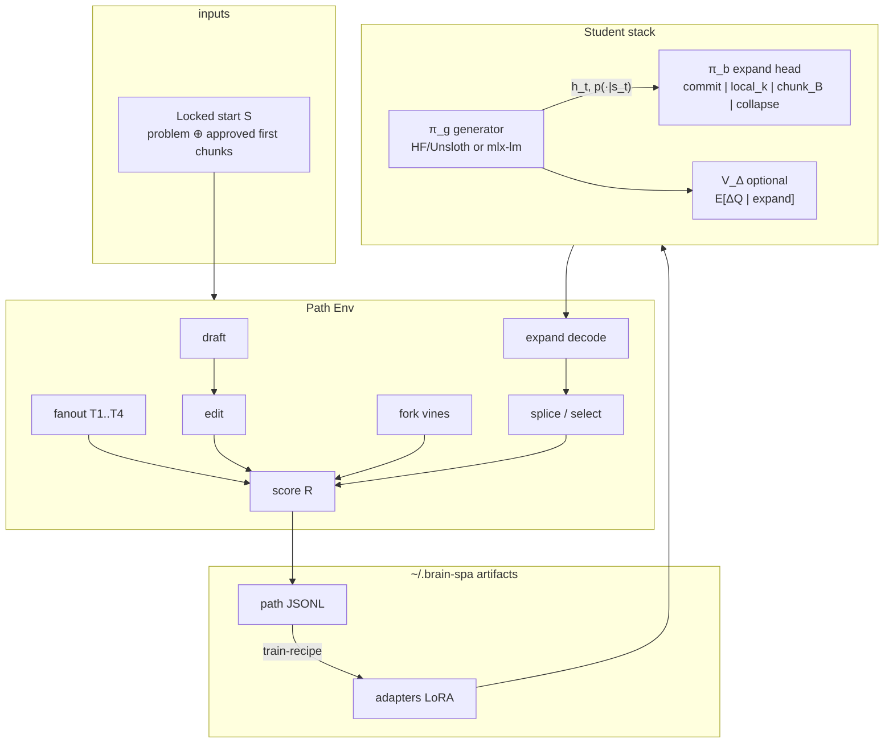
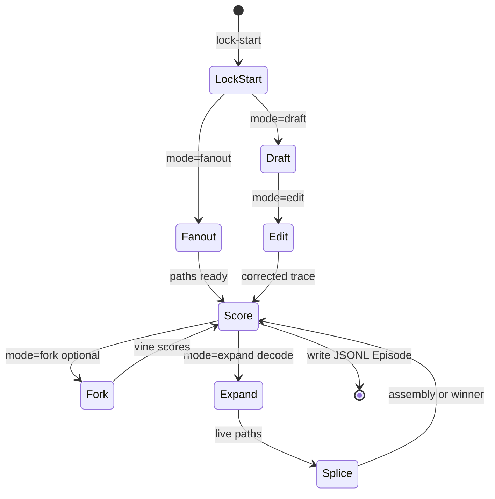
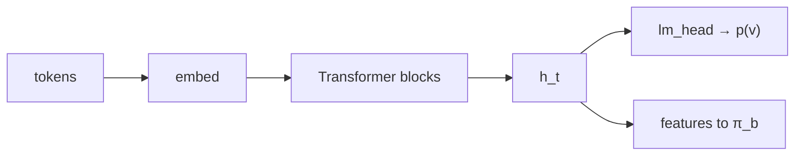
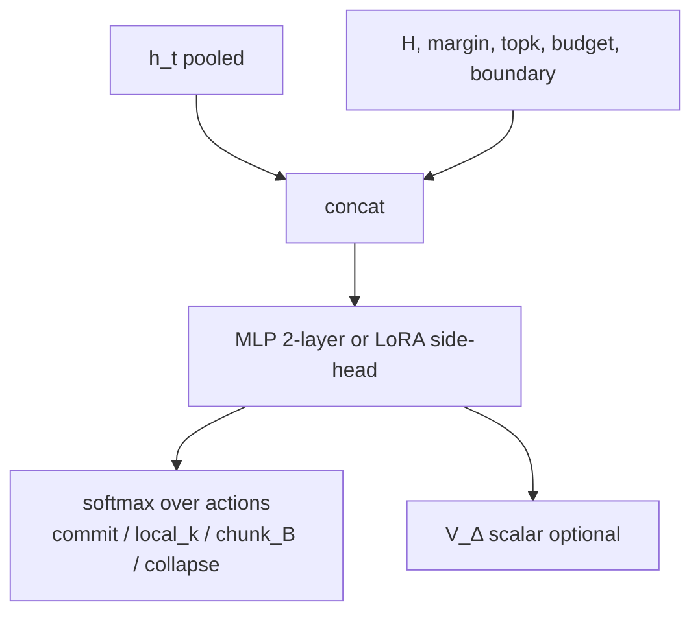
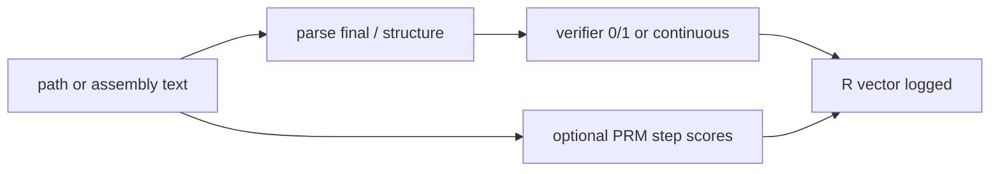
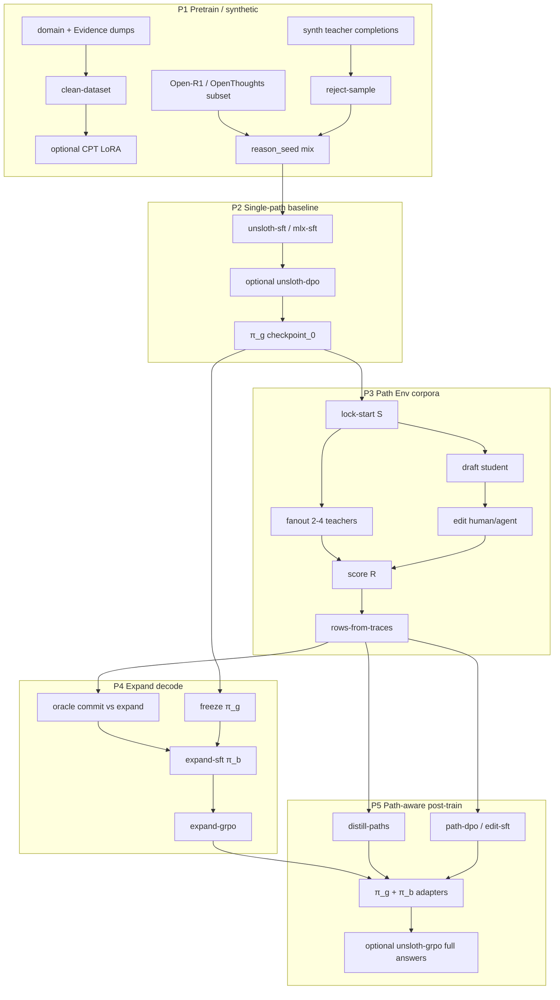
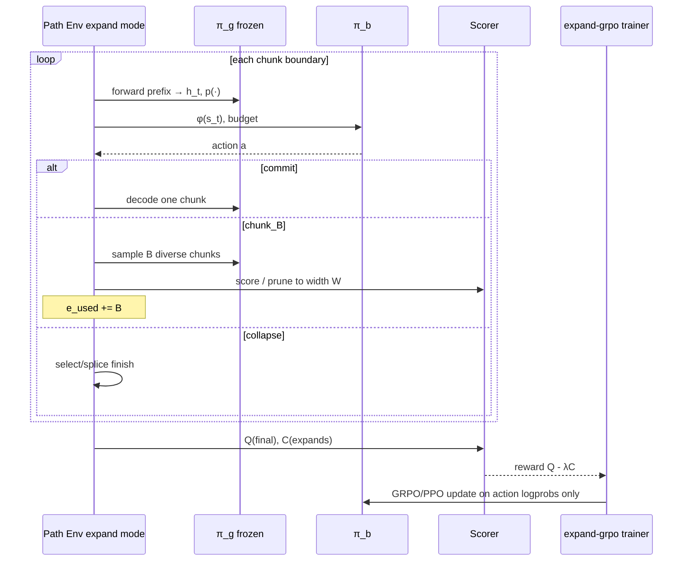
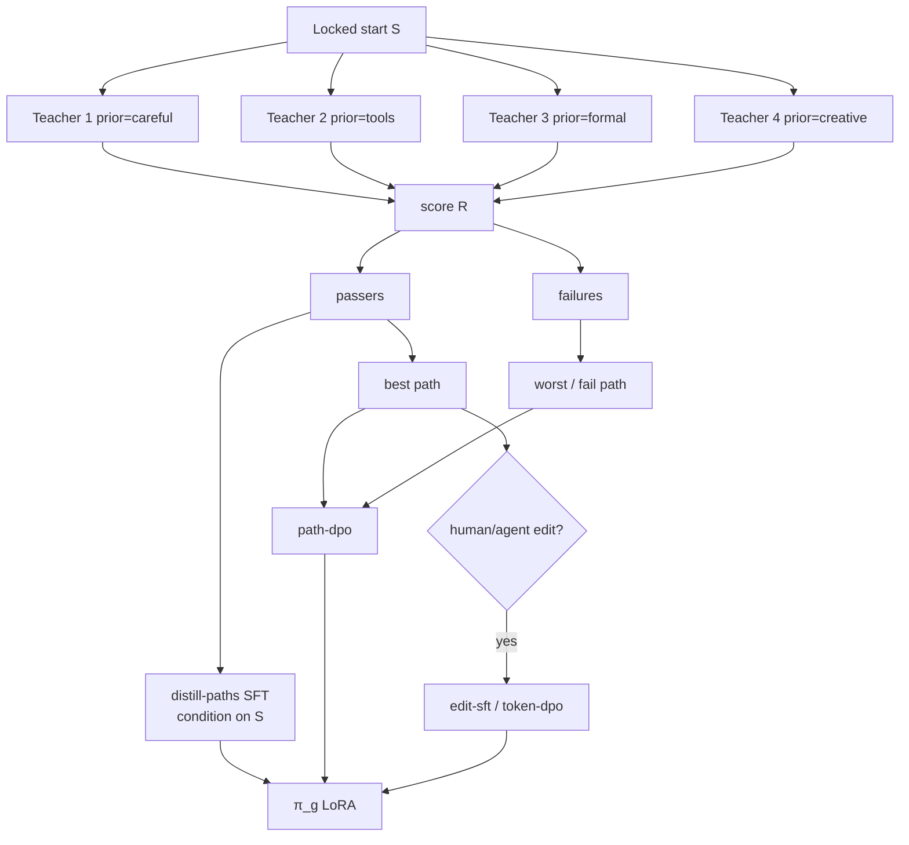

# Plan: Path Model RL And Training Architecture

Status: **architecture / planning only** — no implementation in this PR.  
Parent plan (phases P0–P6): [plan-multi-path-creative-model.md](plan-multi-path-creative-model.md).  
Research rationale: [research-multi-path-creative-decoding.md](research-multi-path-creative-decoding.md).  
OSS catalog: [training-methods.md](training-methods.md).

This doc is the **precise stack**: modules, MDPs, training graphs, and
**exactly how to manipulate** each borrowed repo so it becomes Brain Spa Path
Env machinery — not a generic LLM lab copy.

---

## 1. Target stack (what we actually train)

Three trainable pieces on top of one frozen-or-slow base:

| Symbol | What | Params | When trainable |
|--------|------|--------|----------------|
| `π_g` | Generator LM (student) | Base + LoRA | P2 SFT/DPO; P5 path SFT/GRPO (slow) |
| `π_b` | Expand controller | Tiny head or LoRA on `h_t` | P4–P5 only; **freeze `π_g` first** |
| `V_Δ` | Marginal expand-value head | Shared trunk w/ `π_b` or twin MLP | P4 optional regression |
| Scorer `R` | Verifier / harness / PRM | Usually **frozen** | Shared Test↔Tune (RLVR) |
| Teachers `T_1..T_4` | OSS models | **Never** our product weights | P3 fanout data only |
| Editor | Human or agentic critic | Policy separate / frozen | P3 `edit` mode |



---

## 2. Path Env as one MDP (combined RL envs)

All former “separate RL envs” are **modes** of one Env. Same state family,
different action sets.

### 2.1 Core MDP

| Piece | Definition |
|-------|------------|
| State `s` | `S` + tokens so far + live path set + budget `(E_max − e_used)` + mode |
| Reset | Re-feed any prefix (free in LMs — VinePPO insight) |
| Observation | `h_t`, top-k logprobs, entropy, margin, boundary flag |
| Terminal | `done` when splice/select emits final answer or budget collapse |
| Reward | `R = Q(final) − λ·C(expands) + β·novelty − γ·constraint_fail` |



### 2.2 Mode → action → train signal

| Mode | Actor | Action | Immediate signal | Downstream recipe |
|------|-------|--------|------------------|-------------------|
| `draft` | `π_g` | tokens/chunks | none / format | SFT later |
| `fanout` | Teachers | continue from `S` | pass/fail `Q` | `distill-paths`, `path-dpo` |
| `edit` | human/agent | span replace on trace | `Q_after − Q_before` | `edit-sft`, `token-dpo` |
| `fork` | `π_g` | sample K vines from index `t` | mean vine `Q` | `vine-ppo`, `token-dpo` |
| `expand` | `π_b` then `π_g` | commit / chunk_B / … | cost `C` | `expand-sft/grpo` |
| `score` | scorer `R` | grade path/assembly | scalar / vector | all RLVR |
| `splice` | merger/`π_g` glue | select or aggregate | splice gain | `path-dpo`, optional merger LoRA |

### 2.3 Warping Prime Intellect Agent/Env → Path Env

Borrow **shapes**, not poker/user-sim demos
([rl-post-training.md](rl-post-training.md#multi-agent-rl-prime-intellect)).

| Their piece | Manipulate into |
|-------------|-----------------|
| `Agent.run(task) -> Trace` | Role runners: `StudentAgent`, `TeacherAgent(i)`, `EditorAgent`, `CriticAgent`, `ExpandAgent` |
| `Env.run(task, agents) -> Episode` | `PathEnv.run(problem, mode, agents) -> Episode` with fixed mode schedule |
| `AgenticJudgeEnv` | `mode=score` with CriticAgent that may call tools/tests; **blind** to peer drafts |
| `ProposerSolverEnv` | Optional P6+: ProposerAgent proposes hard `S`; not required for P3 |
| Hierarchical GRPO | Comparison groups keyed by `(role, problem_id)` — never mix teacher traces with `π_b` actions |
| RAE | Separate baselines for student vs critic rewards |

**Do not** depend on `verifiers`/`prime-rl` at runtime in the public shell.
Reimplement the thin Env/Agent/Episode types under
`packages/brainspa_environments/path/` (name TBD) using our harness spec.

---

## 3. Module architecture (precise)

### 3.1 Generator `π_g`



| Choice | Spec |
|--------|------|
| Base | Open instruct LM ≤8B for iteration (CUDA Unsloth or MLX mlx-community quant) |
| Adapters | LoRA/QLoRA on `q,k,v,o` + MLP; `r∈{8,16}`, `α=2r`, dropout 0 |
| Chat template | Pin hash in run meta; wrong template poisons all Path rows |
| Logprobs | Required: HF `output_scores` / vLLM logprobs / mlx-lm per-token — for `π_b` features and forks |

### 3.2 Expand controller `π_b` (+ optional `V_Δ`)



| Spec | Value |
|------|-------|
| Call sites | Chunk boundaries by default; hybrid token gate if `critical_span` |
| Action set | Discrete 4-way (start here). Alt: predict width `B∈{0..B_max}` |
| Input dim | `h_t` (hidden) + ~8 hand features |
| Hidden | 512–1024 MLP or LoRA rank 8 on last block + linear head |
| Train order | (1) freeze `π_g` (2) `expand-sft` (3) `expand-grpo` (4) optional vines |

### 3.3 Scorer `R` (one module)



| Hook | Implementation lean |
|------|---------------------|
| Math/code | Exact match / unit tests — Open-R1 style reward_fn |
| Creative | Rubric LLM **blind** + length penalty; human spot checks |
| Process | PRM800K-trained or Math-Shepherd auto labels — optional P5 |

Same `R` callable from Path Env Test and Unsloth/MLX GRPO `reward_fn`.

---

## 4. Training graphs by phase

### 4.1 End-to-end data → weights



### 4.2 Expand-controller RL loop (precise)



**Group construction for `expand-grpo`:** for one problem, sample G rollouts
that differ in **expand masks** (or λ), not only token noise. Advantage within
group on `Q−λC`. KL to the `expand-sft` reference controller, not to `π_g`.

**Vine credit (optional `expand-vine-ppo`):** at prefixes where `π_b` chose
expand, estimate `V̂(s)` with K vines under commit *and* under expand; advantage
≈ realized return − `V̂`. Aux vines are value-only (VinePPO rule).

### 4.3 Multi-teacher distill + edit (precise)



**Disagreement → expand labels:** if teachers diverge at chunk `c` after `S`,
mark `(S⊕…⊕c)` as `oracle_expand=1` for P4.

---

## 5. Algorithm choice matrix (when to use what)

| Goal | Algorithm | Why | Avoid when |
|------|-----------|-----|------------|
| Imitate good traces | SFT / LoRA | Stable | Traces unverified |
| Prefer path A≻B | DPO / ORPO / TDPO | Cheap pairwise | Need online exploration |
| Full-answer RLVR | GRPO / GSPO | No critic; Unsloth/MLX ready | Need credit inside long CoT |
| Credit at prefix / expand point | VinePPO | MC baseline per `s_t` | Budget too tight for K vines |
| Train `π_b` only | expand-sft → expand-grpo | Separates search policy | Jointly hacking `π_g` early |
| Role-tagged Episodes | Hierarchical GRPO + RAE | Stops mixing role rewards | Single role only |
| Diversity of valid paths | GAPO-style group reward / dedup | Fights paraphrase collapse | Reward encourages gibberish |

Default Brain Spa lean: **GRPO for `π_g` answers**, **expand-grpo for `π_b`**,
**VinePPO only at expand/edit prefixes**, **DPO for path/edit pairs**.

---

## 6. Repo manipulation catalog (exact warps)

For each repo: **take**, **change**, **wire**, **don’t**.

### 6.1 Unsloth — https://github.com/unslothai/unsloth

| Take | Change / manipulate | Wire into |
|------|---------------------|-----------|
| `FastLanguageModel` LoRA load | Pin `max_seq_length` to Path traces; hash chat template | P2/P5 `unsloth-sft/dpo/grpo` |
| GRPOTrainer + `reward_fn` | `reward_fn` = Path Env scorer `R` (import shared module) | P5 full-answer RLVR |
| GSPO flag `importance_sampling_level="sequence"` | Use for long reasoning traces | P5 if GRPO unstable |
| vLLM rollouts `use_vllm` | Same GPU weight share for fanout/expand rollouts | P3/P4 generate |
| Export adapters | Write only under `~/.brain-spa/artifacts/training/<run>/` | Tune UI |

**Don’t:** merge 16-bit into git; use Unsloth for Apple Silicon (use MLX); put
persona system prompts in default template.

**Expand-grpo note:** Unsloth GRPO assumes token actions in completions. For
`π_b`, either (a) train a tiny separate torch module with custom GRPO on
action logprobs, or (b) encode expand decisions as special control tokens in
an auxiliary stream — prefer (a) for clarity.

### 6.2 MLX / mlx-lm / mlx-tune / MLX-GRPO

| Repo | Take | Manipulate |
|------|------|------------|
| mlx-lm | generate, logprobs, LoRA | Primary Mac path for teachers + student |
| mlx-tune / mlx-lm-lora | SFT/DPO/GRPO API | Mirror Unsloth recipe names (`mlx-sft`, …) |
| MLX-GRPO | Pure GRPO + CoT rewards | Swap GSM8K reward for Path `R` |

**Don’t:** run MLX on CUDA Linux hosts as primary.

### 6.3 TRL — https://github.com/huggingface/trl

| Take | Manipulate |
|------|------------|
| `SFTTrainer`, `DPOTrainer`, `GRPOTrainer` | Fallback when Unsloth lacks a loss |
| Open-R1 scripts | Copy **reward_fn + data layout**, retarget datasets to Path JSONL |

### 6.4 Open-R1 / OpenThoughts

| Take | Manipulate |
|------|------------|
| Mixture-of-Thoughts / OpenR1-Math subsets | **P1e seed only** — mix ≤20–30% then replace with Path Env traces |
| GRPO math/code reward patterns | Map to Path `score` mode verifiers |
| Pipeline order distill→GRPO | Becomes P1 seed → P2 SFT → P5 GRPO with *our* paths |

**Don’t:** treat Open-R1 as the final corpus or ship their weights.

### 6.5 VinePPO — https://github.com/McGill-NLP/VinePPO

| Take | Manipulate |
|------|------------|
| MC vines for `V̂(s_t)` | Call only at `π_b` expand points or edit indices |
| Aux vines not in policy grad | Keep that invariant in `expand-vine-ppo` |
| vLLM batching for vines | Shared rollout worker with fanout |

**Don’t:** vine every token (cost explosion).

### 6.6 TDPO — https://github.com/vance0124/Token-level-Direct-Preference-Optimization

| Take | Manipulate |
|------|------------|
| Token-span preference loss | Apply on `edit` spans from Path Env |
| Full-string storage | Keep audit strings; loss mask = edited indices |

### 6.7 PRM800K / Math-Shepherd

| Take | Manipulate |
|------|------------|
| Step-label idea | Auto-label Path chunks via vine-to-final success (Shepherd) |
| PRM as prune signal | Optional inside `expand` prune before splice |

**Don’t:** trust GPT-4 PRM on your local student’s distribution without calibrate.

### 6.8 Tree of Thoughts — https://github.com/princeton-nlp/tree-of-thought-llm

| Take | Manipulate |
|------|------------|
| Thought unit + BFS/DFS | Path Env `expand` chunk generator |
| Value/vote prompts | CriticAgent prompts in `score` mode |
| Creative writing task scripts | Seed **eval** problem set; not product copy |

Replace their search driver with our `π_b` + budget; keep prompts as baselines.

### 6.9 Graph of Thoughts — https://github.com/spcl/graph-of-thoughts

| Take | Manipulate |
|------|------------|
| `aggregate` op | `splice` mode assembly builder |
| GoO controller | Thin wrapper calling Path Env modes |

Aggregate output must be re-scored by `R`; log splice gain.

### 6.10 Self-Refine — https://github.com/madaan/self-refine

| Take | Manipulate |
|------|------------|
| Feedback→refine loop | Baseline finish policy vs splice; optional `edit` auto path |

Always compare against multi-path splice at equal expand count.

### 6.11 EGB / ABS / EDEN (entropy gates)

| Take | Manipulate |
|------|------------|
| Entropy/margin trigger | P4 heuristic `π_b` baseline features |
| Threshold tuning protocol | Tune on **creative** held-out, not GSM8K only |

Learned `π_b` must beat this gate on quality@`E_max`.

### 6.12 Medusa / EAGLE / MTP

| Take | Manipulate |
|------|------------|
| Tree attention / draft heads | **P5+ speed only** after quality policy works |
| Acceptance rules | Retarget acceptance for diversity if used as expand proposals |

**Don’t:** call speculative trees “creativity.”

### 6.13 Datatrove / FineWeb / Dolma / distilabel / Argilla

| Take | Manipulate |
|------|------------|
| Cleaning stages | P1 `clean-dataset` on domain + Evidence |
| Synthetic + judge | P1c synth SFT; preference scrub for path-dpo |
| QC report JSON | Required artifact beside every shard |

Aggressive **within-start** fuzzy/semantic dedup on fanout siblings.

### 6.14 tiny-grpo / mini-grpo

| Take | Manipulate |
|------|------------|
| Readable GRPO loop | Teaching reference for custom `expand-grpo` on `π_b` |
| Reward hook | Plug Path `R` |

Use as the template for the small controller trainer if Unsloth GRPO doesn’t
fit action heads.

---

## 7. Concrete loss / update sketches

### 7.1 `expand-grpo` (controller)

For problem `x`, sample group `{τ_i}_{i=1..G}` of expand trajectories:

```text
r_i = Q(τ_i) - λ * C(τ_i)
A_i = (r_i - mean(r)) / (std(r) + ε)
L = -E_i[ Σ_t clip(ρ_t, 1±ε) A_i log π_b(a_t|s_t) ] + β KL(π_b || π_b_ref)
```

`ρ_t` = importance ratio on **controller** actions only. Generator tokens do
not enter this loss while `π_g` is frozen.

### 7.2 `path-dpo`

Pairs `(y_w, y_l)` both conditioned on same `S`:

```text
L_DPO = -log σ( β (log π_g(y_w|S)/π_ref - log π_g(y_l|S)/π_ref) )
```

`y_w` = best passing path or edited trace; `y_l` = fail/worst/pre-edit.

### 7.3 `edit-sft` / TDPO hybrid

- SFT teacher-force corrected span tokens.
- Optional TDPO on those indices with chosen=corrected, rejected=draft.

### 7.4 Full-answer `unsloth-grpo`

Standard GRPO on completions from `π_g` with `reward_fn=R`. Can run after
path distill; keep KL to P2/P5 SFT ref.

---

## 8. Artifact ↔ recipe map

| Artifact producer | JSONL fields used | Recipe |
|-------------------|-------------------|--------|
| fanout | `start`, `paths[]`, `scores` | `distill-paths`, `path-dpo` |
| edit | `edits[]`, before/after | `edit-sft`, `token-dpo` |
| fork | `index`, vines, scores | `vine-ppo`, `token-dpo` |
| expand oracle | `oracle_expand`, `delta_q`, `delta_c` | `expand-sft`, `expand-delta-reg` |
| expand rollout | controller actions, `Q`, `C` | `expand-grpo` |
| splice | `finish.splice_gain` | eval + optional merger pref |

---

## 9. Implementation order inside packages (when coding starts)

Suggested layout (names indicative):

```text
packages/brainspa_environments/path/
  env.py           # PathEnv modes
  agents.py        # Student/Teacher/Editor/Critic/Expand
  scorers.py       # shared R
  artifacts.py     # JSONL schema

packages/brainspa_training/path/
  expand_head.py   # π_b, V_Δ
  expand_train.py  # expand-sft / expand-grpo / vines
  recipes.py       # thin wrappers calling Unsloth/MLX/TRL
```

API mounts later under `/api/env/path/*` and `/api/policy/path/*` — keep Snake
routes untouched.

---

## 10. Related

- [plan-multi-path-creative-model.md](plan-multi-path-creative-model.md) — phases
- [research-multi-path-creative-decoding.md](research-multi-path-creative-decoding.md)
- [rl-post-training.md](rl-post-training.md) · [token-level-credit.md](token-level-credit.md)
- [oss-tune-backends.md](oss-tune-backends.md) · [datasets-cleaning.md](datasets-cleaning.md)
- [environment-harness-spec.md](environment-harness-spec.md)
